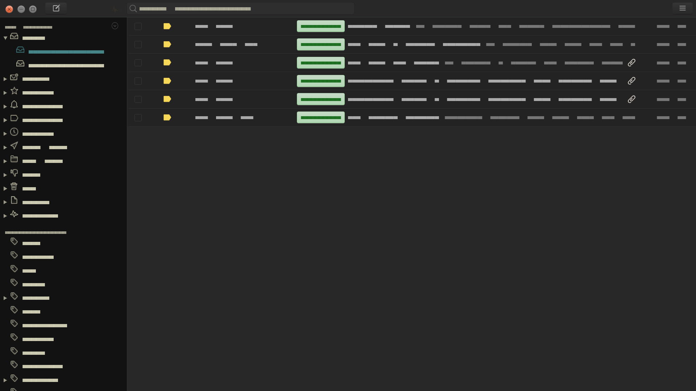

# Gruvbox Theme

Based on the [gruvbox](https://github.com/morhetz/gruvbox) colour scheme made using the [Mailspring Theme Starter](https://github.com/Foundry376/Mailspring-Theme-Starter) for 
the [Mailspring](http://www.getmailspring.com/) email client.

Feel free to change the colours in `sytles/ui-variables.less` if you don't like the blue (all the gruvbox colours are available to use)

## Getting Started

1. Download the code.

2. Open Mailspring  and install the theme by going to `Mailspring > Install New Theme...`
   and selecting the directory.

